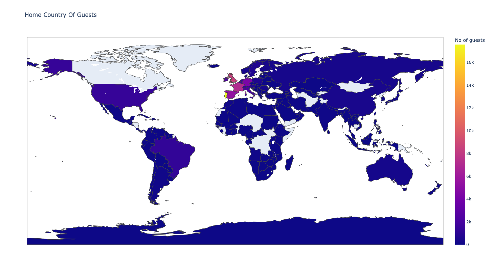
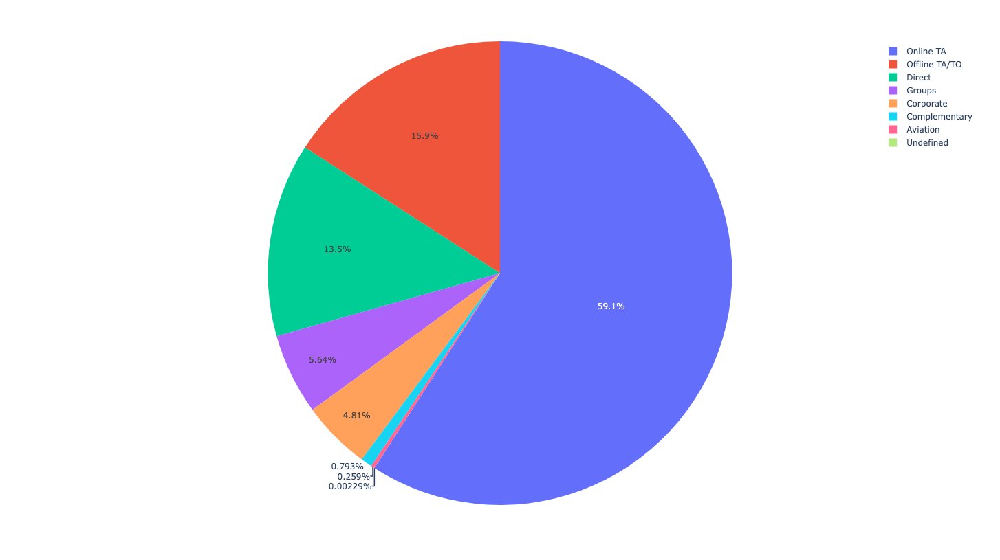
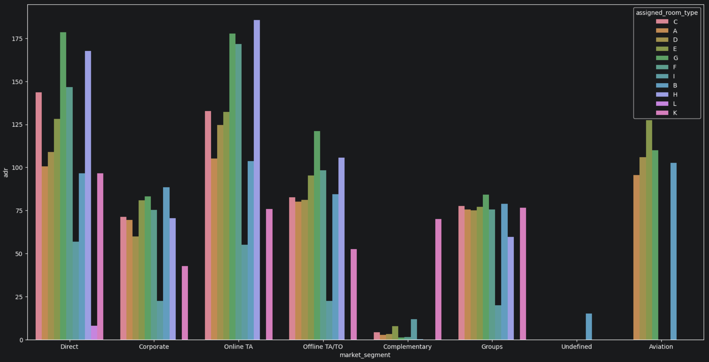
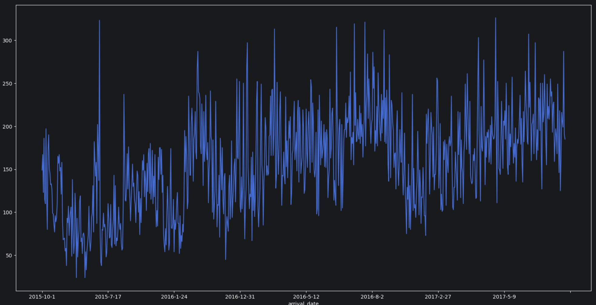
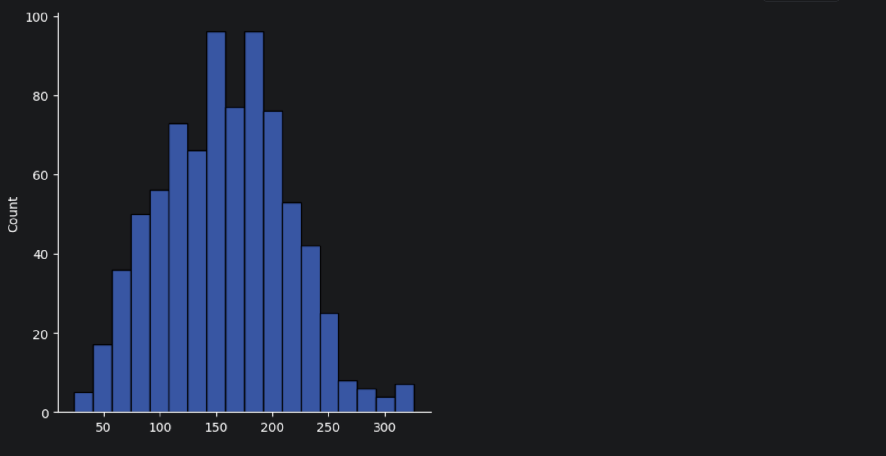

# Hotel Booking & Guest Behavior Analysis

This project builds an end-to-end data analysis pipeline using Python to transform raw hotel booking records into actionable business insights. The pipeline cleans the dataset, conducts descriptive and spatial statistics, and visualizes customer distribution and booking trends.

## 🛠️ Tech Stack & Libraries
* Programming Language:    Python
* Data Manipulation:       Pandas, NumPy
* Data Visualization:      Plotly Express, Plotly Offline
* Development Environment: PyCharm IDE, Git, GitHub

##  Data Cleaning Pipeline
Before conducting analysis, the raw dataset was processed to ensure high data integrity:
* Filtering Active Bookings: Removed all rows where bookings were cancelled (`is_canceled == 1`), dropping 1,80 rows to focus strictly on actual hotel guests.
* Deduplication: Identified and removed 31,980 duplicate rows** to prevent data skewing.
* Final Cleansed Dataset: Successfully obtained 87,230 unique, non-duplicate records for downstream analysis.

## 📊 Exploratory & Descriptive Data Analysis

### 1. Descriptive Statistics
Conducted statistical summaries on guest demographics (Adults, Children, Babies) and stay durations:
* Calculated central tendencies (Mean, Median).
* Computed Standard Deviation to understand data variance and spread.
* Extracted Percentile and Quantile values (25th, 50th, 75th percentiles) to analyze distribution limits and detect data outliers.

### 2. Segment Analysis via Cross-Tabulation
* Utilized Pandas `crosstab` functions to create structured Pivot Tables.
* Analyzed relationships between booking variables to isolate behavioral differences across multiple guest segments.
# Hotel Guest Analysis Project

## 📈 Visualizations & Core Insights

### 1. Spatial Analysis: Guest Home Countries
Visualized the geographical hometowns of guests to identify primary international markets.

### 2. Market Segment Breakdown
Analyzed which booking segments generate the bulk of overall business.

### 3. Highest Bookings by Segment (Bar Plot)
Identified the specific market channels driving the maximum volume of successful check-ins.

### 4. Arrival Patterns & Trends
Mapped out guest arrival behaviors over time to identify peak booking seasons and operational demands.

### 5. Guest Distribution Analysis (Histogram)
Examined customer volume spreads to understand common group sizes per booking.

